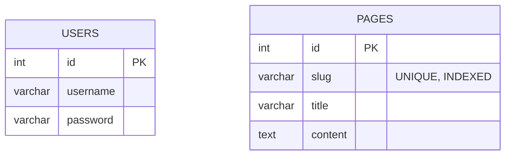

> Full credit to Jannis Seemann, creator of the original [Modern PHP: The Complete Guide - from Beginner to Advanced](https://www.udemy.com/course/modern-php/) course on Udemy.  
> This project was built while following his lessons, with a few personal improvements.

# CMS Project

A lightweight PHP Content Management System built while learning modern backend development with PHP.  
It includes a simple frontend for displaying pages and an admin area for managing content and authentication.

---

## 🚀 Overview

This project is a learning exercise focused on building a small PHP web app **from scratch**, without any framework.  
It follows an MVC-inspired approach with:
- a single entry point (`index.php`)
- controllers for handling requests
- repositories for database logic
- PHP templates for rendering pages

It was developed to practice structuring code, managing dependencies, and understanding the core ideas behind modern PHP development.

---

## ✨ Features

- Frontend and admin sections with separate layouts  
- CRUD management for pages (create, edit, delete)  
- Authentication system with session-based login  
- CSRF protection for all forms  
- Environment configuration via `.env`  
- Dependency Injection through a simple custom container  
- Database operations using PDO and prepared statements  
- Minimal PHP templating with layout composition

---

## 🧰 Technologies Used

- **Language:** PHP 8.2+  
- **Database:** MariaDB (via PDO)  
- **Libraries:**  
  - `vlucas/phpdotenv` – environment configuration  
  - Composer PSR-4 autoloading  
- **Other tools:** HTML, CSS, basic session handling

---

## 🗂️ Project Structure

```
index.php              → front controller and basic router
inc/                   → configuration and helper scripts
src/
  ├── Admin/
  │   ├── Controller/  → admin controllers
  │   └── Support/     → AuthService (authentication)
  ├── Frontend/
  │   └── Controller/  → frontend controllers
  ├── Repository/      → PagesRepository (CRUD logic)
  ├── Model/           → PageModel (data representation)
  └── Support/         → Container, CsrfHelper
views/
  ├── admin/           → admin templates
  └── frontend/        → public templates
```

---

## 🗃️ Database



Both tables are accessed via prepared statements and hydrated into models using `PDO::FETCH_CLASS`.

---

## 🎓 Learning Value

This project focuses on **clarity and understanding**, rather than completeness or production scale.  
It helps practice:
- structuring a PHP app with MVC principles  
- dependency injection and service binding  
- secure database work with PDO  
- implementing authentication, sessions, and CSRF protection  
- writing clean, readable code with modern PHP features (typed properties, named parameters)

---

## 🧩 Notes

Designed for a local PHP environment (Apache/XAMPP or built-in server).  
This repository remains a personal learning project for exploring modern PHP development.

---